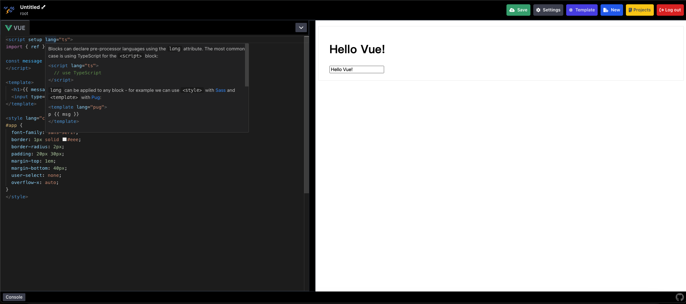

<p align="center">
  
</p>

<h1 align="center">Code Immediate</h1>

<p align="center">
  This is an online code editing and preview tool, similar to <code>CodePen</code>.
</p>

<p align="center">
  <a href="https://github.com/tzuyi0817/code-immediate/blob/master/LICENSE">
    
  </a>
</p>

<p align="center">
  <a href="https://code-immediate.vercel.app">
    
  </a>
</p>

<br>
<br>



## Features

[o] Built-in many frontend templates  
[o] Support multiple preprocessing languages  
[o] Support `Vue 3 SFC`  
[o] `Vue 3 SFC script` language is support `js` and `ts`  
[o] `Vue 3 SFC template` language is support `html`, `haml`, `markdown` and `pug`  
[o] `Vue 3 SFC style` language is support `css`, `less`, `scss`, `sass`, `stylus` and `postcss`  
[o] Support for save code  
[o] Built-in support for using ES module syntax on browsers using [jsdelivr](https://cdn.jsdelivr.net), [esbuild](https://esbuild.vercel.app) and [importmap](https://github.com/WICG/import-maps)  
[o] Support code formatting  
[o] Support setting [CDNjs](https://cdnjs.com/) for use  
[o] Support github third-party login  
[o] Support export `zip`  
[o] Support embedded mode for easy use in documentation sites, making documentation examples easier  
[o] Support sharing code URL to others to view  
[o] Support console results to facilitate coding

## Development

To get started with development, clone this repository and install dependencies using `pnpm`:

```sh
git clone https://github.com/tzuyi0817/code-immediate.git
cd code-immediate
pnpm install
```

Then, you can use the following commands:

- `pnpm dev`: Run in development mode
- `pnpm build`: Build for production
- `pnpm preview`: Run a local server to preview the production build

## Built-in frontend framework

- React
- Vue
- Vue3 SFC
- Angular
- SolidJs
- RxJS

## Support ES module syntax

Currently, ESM can be used in `JavaScript`, `TypeScript`, `CoffeeScript`, etc. By default, if you directly import a module like this:

```js
import moment from 'moment';
```

It will be converted into a `script` tag and placed in the `html` head:

```html
<script src="https://esbuild.vercel.app/moment@latest?format=iife"></script>
```

In the case of `script type="module"` (e.g., `Vue3 SFC` or `SolidJs`), it will be converted into:

```js
import moment from 'https://cdn.jsdelivr.net/npm/moment/+esm';
```

## Support Languages

| Category | Language                                    |
| :------- | :------------------------------------------ |
| HTML     | Haml, Markdown, Pug                         |
| CSS      | Less, SCSS, Sass, Stylus, PostCSS           |
| JS       | Babel, TypeScript, CoffeeScript, LiveScript |

## Technologies Used

- Frontend: vue3, typescript, tailwindcss, pinia
- Environment construction: vite, eslint, prettier
- Code editor: monaco editor
- File load: loadjs
- ZIP Handling: jszip, file-saver
- Test: vitest, @testing-library, msw

## License

This project is licensed under the [MIT](./LICENSE) License.
